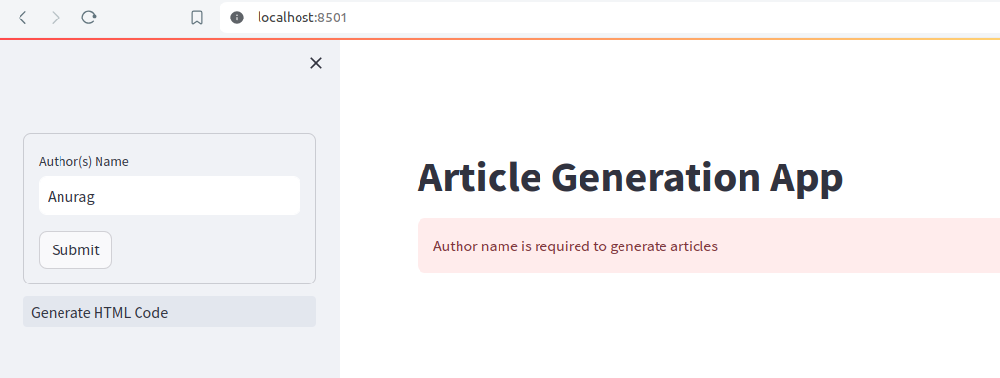
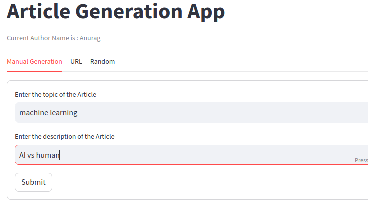
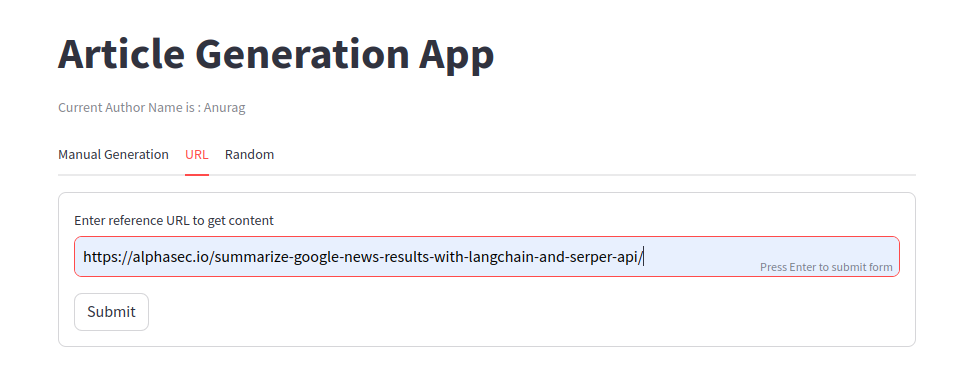
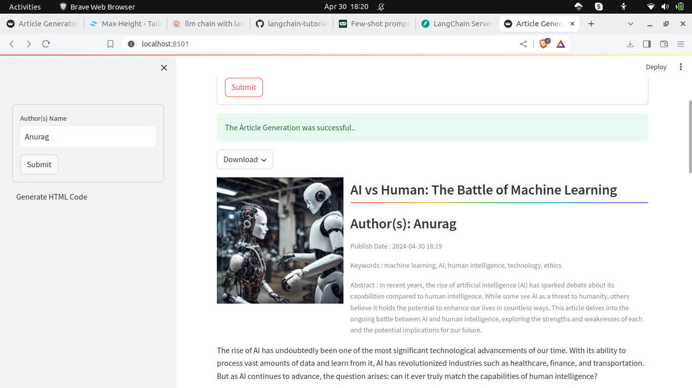
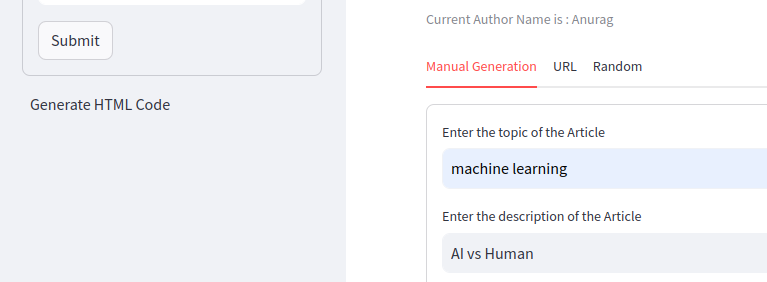
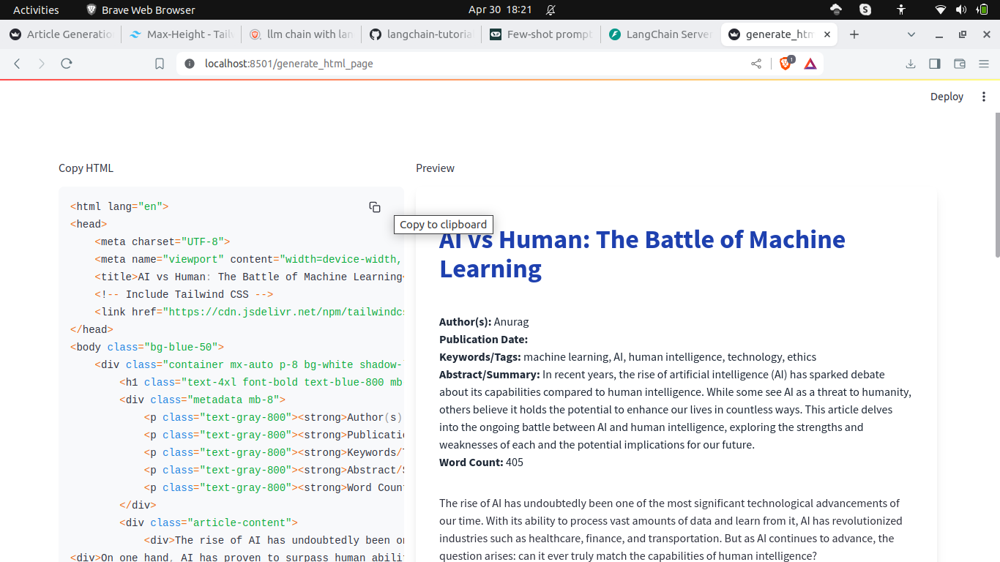

# Usage Guide

## Clone Repo

```
git clone https://github.com/1md3nd/Article-Generation
```

## Setup Client

### Installing 

```
cd client
```
Create Virtual Environment

```
python3 -m venv client_env
```
Activate environment
```
source ./client_env/bin/activate
```
Install requirements
```
pip install -r requirements.txt
```

### To run the client (Streamlit)

```
streamlit run streamlit_app.py
```
#### The frontend should be running on `localhost:8501` 

## Setup Server

```
cd server
```
Create Virtual Environment

```
python3 -m venv server_env
```
Activate environment
```
source ./server_env/bin/activate
```
Install requirements
```
pip install -r requirements.txt
```

### setting .env file

Rename `.env.example` to `.env`

replace these values to your API keys
```
STABILITY_API_KEY = "sk-xxxxxxxxxxxxxxxxxxxxxxxxxxxxxxxxxxxxxxxxxx"

CLOUDINARY_CLOUD_NAME = 'xxxxxxxxx'
CLOUDINARY_API_KEY = "0000000000000"
CLOUDINARY_API_SECRET = "xxxxxxxxxxxxxxxxxxxxxxxxx"

OPENAI_API_KEY = "sk-xxxxxxxxxxxxxxxxxxxxxxxxxxxxxxxxxxxxxxxxxxxxxxxxxxx"
```


### To run the langserve

Install `langchain-cli`

```
pip install -U langchain-cli
```

Run server
```
langchain serve
```

#### The backend server should be running on `localhost:8000`

## Use Streamlit

### 1. Home Page

First we have to fill the Author name to able to use the service.



### 2. Manual Form
In this we can provide our topic and description to generate a article



### 3. URL Form

In this we can provide a URL from which it will take reference to generate the article.


### 4. Resulting Article

The Generate article



### 5. Generating HTML Code

By clicking on Generate HTML Code, we can switch to another page where we can find the HTML code.


### 6. HTML Code

This page will contains HTML code with Visuals

