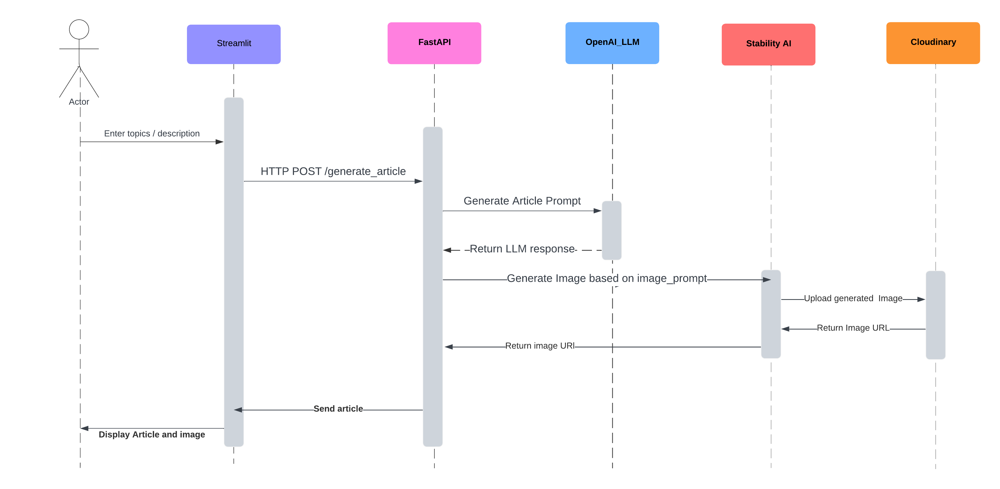

# Article Generation

## Introduction

This Proof of Concept (POC) aims to demonstrate the capability of generating SEO- optimized article based on given topics/descriptions or other article reference. It also includes features such as displaying the generated article in HTML, generating metadata, and integration of images generation using Stability.ai.
The technical implementation involves usage of OpenAI (LLM) for article generation, Stability.ai to generate images, and Cloudinary for image upload.

## Business/ Product Requirements
- Generate SEO-optimized articles from given topics.
- Create a user interface to facilitate article generation.
- Generate meta information for the articles.
- Display the article in an iFrame.
- Utilize Streamlit for UI.
- Integrate image generation using Stability.ai.
- Upload images to a third-party website such as Cloudinary.
- Analyze prompt engineering costs.

## Technical Requirements
- Implement a backend using FastAPI and Langchain to handle article generation and image upload.
- Utilize OpenAI's LLM for article generation.
- Integrate Stability.ai for image generation.
- Use Cloudinary API for image upload.
- Implement a frontend using Streamlit for the user interface.

## Proposed Architecture and Design
- **Backend** :  Langchain and FastAPI server handling article generation and image upload.
- **Frontend** : Streamlit UI for user interaction.
- **Services** : OpenAI LLM for article generation, Stability.ai for image generation, Cloudinary for image upload.
- **Data Model** : Data models for OpenAI output parsing and response templates.

## Constraints
- The integration of Stability.ai for image generation might have some limitations in terms of image quality and desirability.
- Depending on the complexity of article topics, the accuracy and relevance of generated articles may vary.

## Key Learnings and Takeaways
- Streamlining integration with third-party APIs.
- Understanding the nuances of article generation with LLM and image generation with Stability.ai.
- Managing prompt engineering costs effectively.

_This documentation provides a comprehensive overview of the POC, outlining its objectives, technical requirements, proposed architecture, constraints, resources, key learnings, and recommendations for future implementations._

### [HOW TO USE](./HowToUse.md)
## Project Structure
### 1. [Server (ReadMe)](./server/ReadMe.md)
The folder contains all the services running in server side.
- `server/app/server.py` : 
Contains the langserver 
(FastAPI) files.

- `server/helper/models.py`
Contains the Data Models for Input and Output of llm

- `server/helper/prompts.py`
Contains all the prompts used for chain.

- `server/openai_article_generator/article_generator.py`
Contains the article generation chains,llm model.

- `server/stablilty_with_cloudinary/image_generator.py`
Contains the Wrapper for Stability.ai image generation and Cloudinary image uploader.

### 2. [Client (ReadMe)](./client/ReadMe.md)
This folder contains all the services running at client side.
- `client/streamlit_app.py` : Contains the streamlit app (base).

- `client/pages/generate_html_page.py` : Contains the pages included in streamlit.

- `client/utils/generate_html.py` : Contains the utility to generate the HTML code.
## Function Calls and Interactions:
1. **Server-Side**:
- FastAPI receives HTTP requests from the client-side interface.
- OpenAI LLM generates articles based on topics or descriptions provided in the requests.
- Stability.ai is invoked to generate images based on prompts received from the OpenAI LLM.
- Cloudinary handles image upload and storage, returning image URLs.

2. **Client-Side**:
- Streamlit provides a user-friendly interface for users to input topics or descriptions.
- The input data is sent to the FastAPI server via HTTP POST requests.
- The server-side components generate articles and images based on the input data.
- The generated article content, along with image URLs, is returned to the client-side interface.
- Streamlit displays the article content and images to the user in an interactive manner.

## Sequence diagram

# Demo

https://github.com/1md3nd/Article-Generation/assets/61619621/67d11aa8-f33d-43eb-89c9-65df908a5f19

